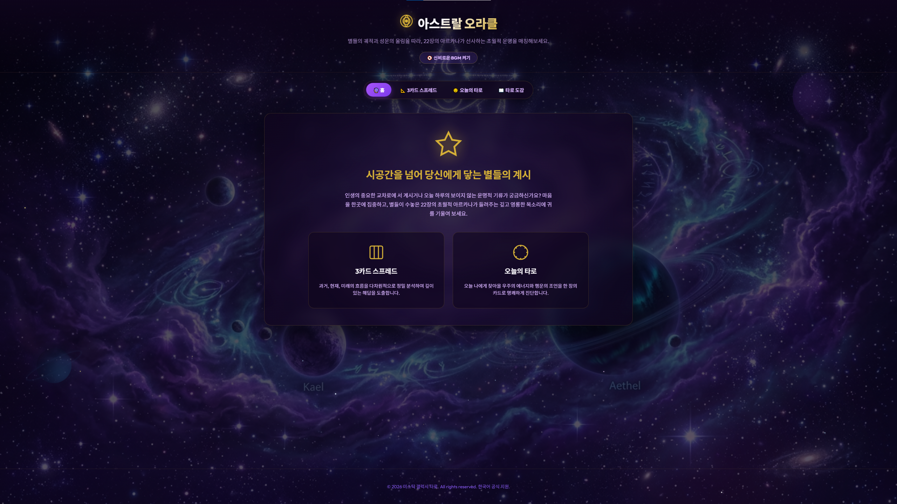

# 🌌 아스트랄 오라클 (Astral Oracle) - 성운의 계시와 타로

> **별들의 궤적과 성운의 울림을 따라, 22장의 메이저 아르카나가 선사하는 초월적 운명을 매칭해보세요.**

아스트랄 오라클(Astral Oracle)은 신비롭고 몽환적인 우주 성운 테마를 배경으로 과거, 현재, 미래의 흐름을 짚어주는 **3카드 스프레드**와 하루의 운세를 예측하는 **오늘의 타로(1카드 드로우)**를 제공하는 프리미엄 웹 어플리케이션입니다. 

외부 라이브러리 의존성 없이 순수 HTML, CSS, JavaScript로 구현되었으며, 로컬 파일 더블클릭(`file://`) 실행 및 웹 서버 호스팅 배포를 동시에 완벽 지원합니다.

## 📷 미리보기 (Preview)



---

## ✨ 핵심 기능 (Features)

1. **📐 3카드 스프레드 (과거·현재·미래):**
   * 마음속의 질문에 집중하고 22장의 카드 중 3장을 직접 드로우하여 다차원적인 시간의 흐름과 영혼의 지혜가 담긴 조언을 분석합니다.
   * 카드 드로우 도중 선택 취소 및 추가가 가능하여 유연한 인터랙션을 보장합니다.
2. **🌞 오늘의 타로 (One-Card Draw):**
   * 매일 아침 나에게 찾아올 우주의 에너지와 행운의 비결을 한 장의 카드로 명쾌하게 진단받습니다.
3. **📖 메이저 아르카나 백과사전 (도감):**
   * 22장 아르카나 카드의 정방향/역방향 상징과 비밀스러운 조언을 한자리에서 깊이 있게 탐독할 수 있습니다.
4. **🪐 3D 입체 카드 플립 및 가로 휠 스크롤:**
   * 모바일 및 모든 브라우저(Safari 포함)에서 흔들림 없이 매끄럽게 돌아가는 3D 카드 뒤집기 메커니즘을 제공합니다.
   * 22장의 카드가 fanned deck 형태로 나열될 때 마우스 휠 스크롤을 통해 좌우로 부드럽게 넘겨가며 카드를 고를 수 있습니다.
5. **🎻 Web Audio API 실시간 사운드 합성:**
   * mp3 등 용량이 큰 외부 음원 다운로드 없이, 브라우저가 직접 주파수를 발진시키는 4채널 오실레이터와 LFO(저주파 진동자)를 통해 **신비롭게 위상 변화가 일어나는 우주 앰비언트 BGM**을 실시간으로 합성 및 재생합니다.
   * 카드 드로우, 카드 셔플, 완료 차임 등의 소리 또한 실시간으로 주파수 변조 방식으로 출력됩니다.
6. **🎨 코스믹 일러스트 & Twinkle 배경:**
   * 우주 행성이 서서히 유영하고 성운이 일렁이며, 75개의 파스텔톤 별들이 서로 다른 주기로 눈부시게 깜빡이는 천체 스펙트럼 백그라운드를 연출합니다.
7. **♿ 초고가시성 웹 접근성 (A11y):**
   * 모든 카드 드로우 및 모달 탐색 과정에서 키보드 Tab 및 Enter/Space 내비게이션을 완벽 제공합니다.
   * 초점이 머무는 곳에 눈부신 골드 포커스 링 광원 효과를 부여하여 시인성을 높이고, 모달 오픈 시 포커스를 닫기 버튼으로 가둔 후 닫힐 때 원래 위치로 되돌리는 스텝 포커스 리커버리 시스템을 적용했습니다.

---

## 🛠️ 기술 스택 (Tech Stack)

* **프론트엔드 구조:** HTML5 Semantic Markup
* **스타일링:** Vanilla CSS3 (Custom Variables, 3D CSS Transforms, Webkit prefix 지원, Galaxy Theme)
* **논리 엔진:** Vanilla ES6+ JavaScript (기능별 네임스페이스 기반 모듈화 구조)
* **사운드 엔진:** Web Audio API (OscillatorNode, BiquadFilterNode, GainNode, LFONode 기반 합성)
* **이미지 포맷:** 차세대 최적화 WebP 규격 (품질 80, 원본 대비 80% 이상의 트래픽 감소) + 지연 로딩(`loading="lazy"`) 적용

---

## 📂 프로젝트 구조 (Directory Structure)

```text
├── index.html                  # 메인 HTML 마크업 및 레이아웃 프레임
├── style.css                   # 디자인 시스템, 우주 애니메이션 및 3D 플립 스타일시트
├── app.js (제거됨)              # 로컬 테스트용 통합 임시 스크립트 (js/로 모듈화 분할)
├── images/                     # WebP 타로 일러스트 및 우주 배경 이미지 자원
│   ├── tarot-card-back.webp    # 카드 뒷면
│   ├── tarot-fool.webp         # 0. 바보 카드 앞면
│   │   ...                     
│   ├── tarot-world.webp        # 21. 세계 카드 앞면
│   └── cosmic-background.jpg   # 천체 우주 배경화면 이미지
└── js/                         # 기능별로 깨끗이 분산 배치된 JavaScript 모듈
    ├── db.js                   # 22장 카드 번호, 이름, 텍스트 데이터베이스
    ├── state.js                # 단일 상태 머신 (선택 카드 개수, 정/역방향 맵 보존)
    ├── audio.js                # Web Audio API 사운드 및 BGM 실시간 합성 엔진
    ├── ui.js                   # 카드 셔플 휠, 모달 열기/닫기 등 프레젠테이션 뷰 렌더링
    └── main.js                 # DOM 로드 핸들링 및 전역 이벤트 리스너 바인딩 (엔트리 포인트)
```

---

## 🚀 로컬 실행 방법 (How to Run Locally)

본 어플리케이션은 브라우저 보안 제약(CORS)을 회피하도록 설계되어 있어 두 가지 방법 모두 완벽하게 작동합니다.

### 방법 1. 간편 실행 (더블 클릭)
* 윈도우 탐색기에서 `index.html` 파일을 더블클릭하여 바로 구동합니다.
* 별도의 개발 서버 구축이나 환경 설정 없이 모든 브라우저에서 바로 우주 배경과 음악이 어우러진 타로 서비스를 즐길 수 있습니다.

### 방법 2. 개발 서버 기동 (VS Code Live Server / Node.js http-server)
* 프로젝트 루트 디렉토리를 열고 로컬 웹 서버를 실행합니다.
  ```bash
  # npm이 설치된 경우 간단히 실행
  npx http-server .
  ```
* 브라우저에서 제공하는 로컬 주소(예: `http://127.0.0.1:8080`)로 접속합니다.


